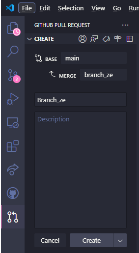

# Branchs

## Main

must be the most estable version of the code

## Other branchs

anything new to be developed, must be done on a new branch

## Naming

- for new features, name the branch with "feat/<descriptive_name_of_what_the_branch_do>"

- for new fixes, name the branch with "fix/<descriptive_name_of_what_the_branch_do>"

- for new refactorations, name the branch with "refactor/<descriptive_name_of_what_the_branch_do>"

## Pull Request

A new branch must be created for any job, this will keep the main the most stable version of the code. Once the job is done, we must follow the steps:

### 1 - update main
commands: 
1.1 -> change to main
    
    git checkout main 

1.2 -> update main
    
    git pull

### 2 - update your branch with main

2.1 -> return to the branch you are working on
    
    git checkout <branch_name>

2.2 -> update the branch code with main in order to avoid code conflicts
    
    git merge main

### 3 - open a PR (Pull Resquest) to main
    
#### 3.1 VScode Extension 'GitHub Pull Requests'

step 1: Click on button 'Create Pull Request'

step 2: Select the branch e describe the changes done in branch

3.5 Press 'Create'

# Commits

## Naming

- for new addition, name the commit with "add: <description of comming changes>"

- for new fixes, name the commit with "fix: <description of comming changes>"

- for a commit of something that wasn't finished, name the commit with "wip: <description of comming changes>", a further explaination is that 'wip' stands for 'work in process'

- for a commit that removes something of the code, name the commit with "rm: <description of comming changes>"

- for a commit that udpates something that were already working, name the commit with "updt: <description of comming changes>

## Good habits

Commit must be should be small, this means that every commit should be a single change

